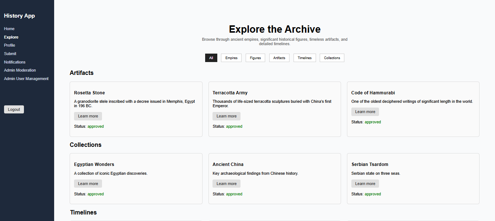
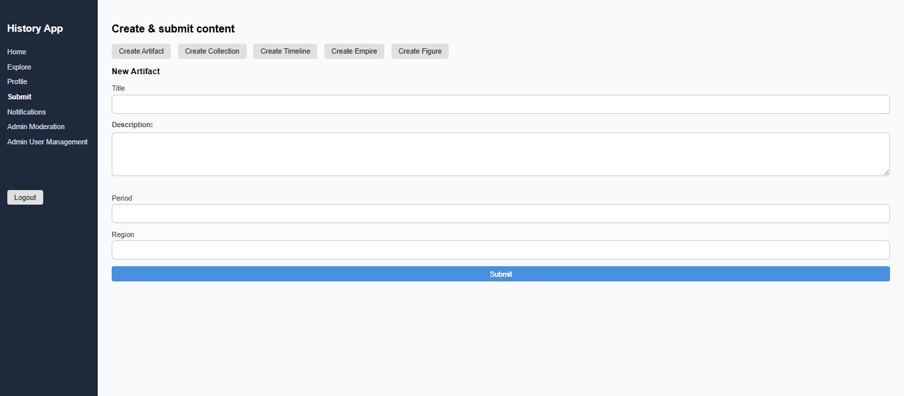
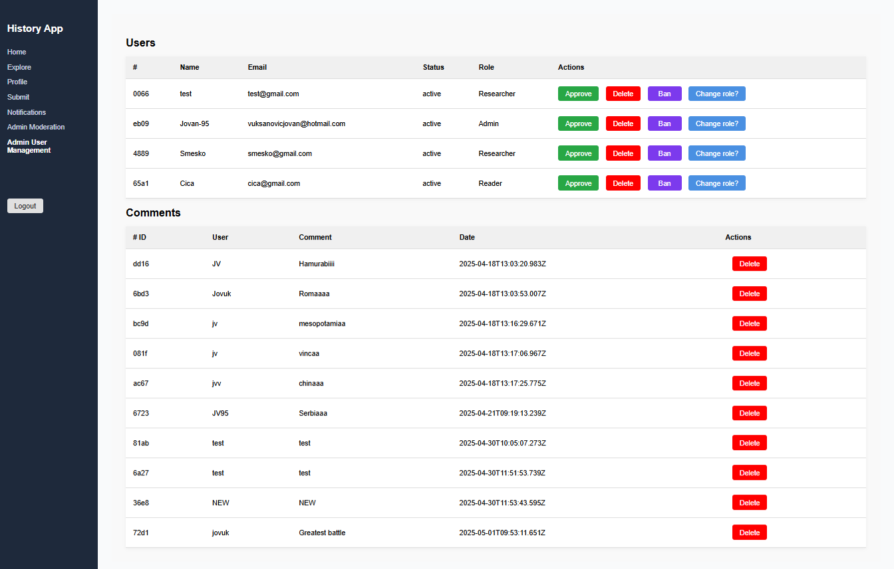
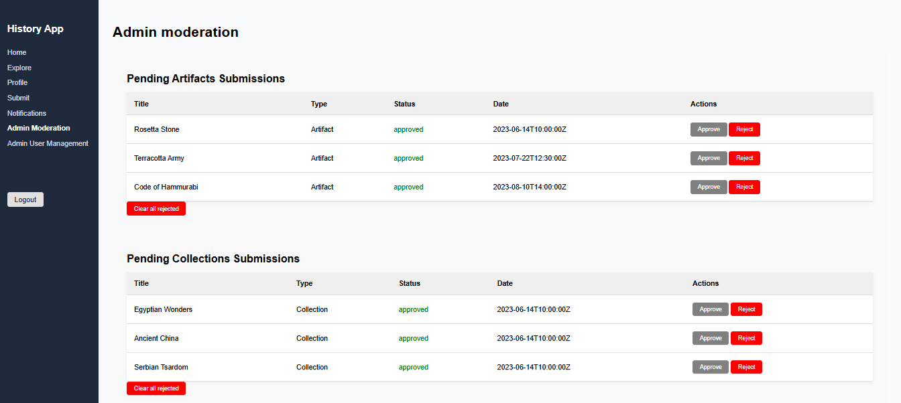

# Ancient History Archive App

A comprehensive React application for exploring, submitting, and managing rich content about ancient history, including empires, figures, artifacts, timelines, and articles. The app supports role-based access control, content moderation, user management, bookmarking, notifications, and more.

---

## Features

- **User Authentication & Authorization**: Login, Registration, and role-based access (Admin, Researcher, Reader).
- **Role-based Dashboards**: Customized views and permissions for different user roles.
- **Content Browsing**: Explore ancient empires, historical figures, artifacts, articles, and timelines with filters and search.
- **Content Submission**: Contributors and admins can submit new content with dynamic forms.
- **Admin Moderation**: Approve, reject, ban users, and manage content submissions.
- **User Management**: Admin panel for banning, promoting, and deleting users.
- **Notifications System**: Real-time toast notifications and a dedicated notifications page to review all alerts.
- **Bookmarks**: Users can bookmark content for later reference.
- **Interactive UI**: Modal dialogs, loaders, and responsive design.
- **Persistent State**: Uses Redux Toolkit with localStorage persistence for auth and notifications.
- **Modern React**: Utilizes React Router v6, React Query for data fetching, and lazy loading with Suspense for performance.

---

## Technologies

- React 18+
- Redux Toolkit
- React Router v6
- React Query
- React Toastify
- JavaScript (ES6+)
- CSS / SCSS (with custom styling)
- Axios (for HTTP requests)
- JSON Server / Mock Backend (for API simulation)
- Netlify (for deployment)

---

## Architecture

The app is structured with clear separation of concerns:

- **Pages**: Top-level routes such as Home, Login, Register, Dashboard, Explore, Profile, Admin panels.
- **Components**: Reusable UI elements like Modal, Loader, Toast, Navbar, Sidebar.
- **Redux Slices**: Manage auth, notifications, bookmarks, and UI state.
- **Services**: API calls abstracted in service functions.
- **Routing**: Protected routes with role-based access control using wrapper components.

---

## Screenshots

### 🏠 Home Page



### 🎬 Create Content Page



### 🗂 Admin Panel



### 📖 Moderation Section

## 

## Installation

1. Clone the repository:

```bash
git clone https://github.com/Jovan-95/ancient-history-archive.git
cd ancient-history-archive
```
